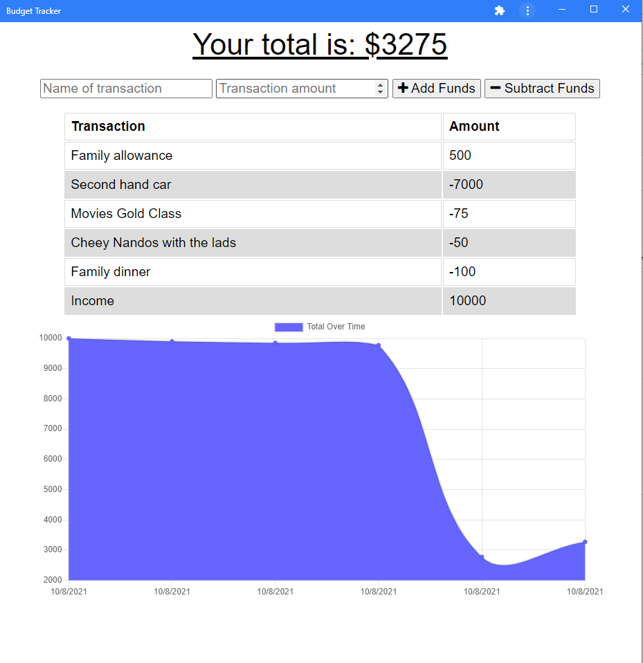

# Budget Tracker

A progressive web application for budget tracking. Its main functionality is that it can installed and used for offline use.

## User Story

AS AN avid traveller
I WANT to be able to track my withdrawals and deposits with or without a data/internet connection
SO THAT my account balance is accurate when I am traveling

## Business Context

Giving users a fast and easy way to track their money is important, but allowing them to access that information anytime is even more important. Having offline functionality is paramount to our applications success.

## Functionality

This application is a PWA so it can be installed. It has offline functionality so that it will log the new transactions once it connects back online.

## Links

[Deployed Link](https://chandtheman1-budget-tracker.herokuapp.com/)

## How to use it 

`npm install` to install all dependencies

`mongod` to run the local database

`npm run start` to start the application locally

## Technologies Used

- Node.js
- NPM Libraries
    - Express
    - Mongoose
    - Morgan
- MongoDB Atlas

## Images

